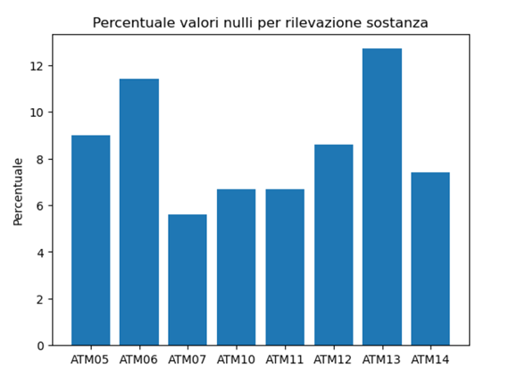
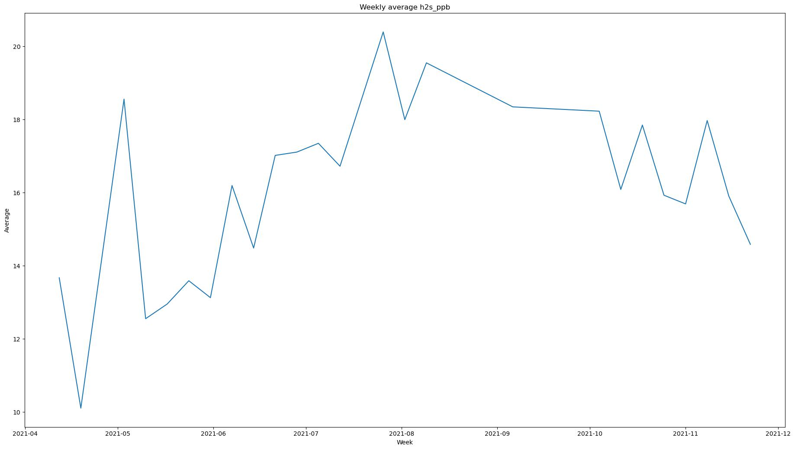
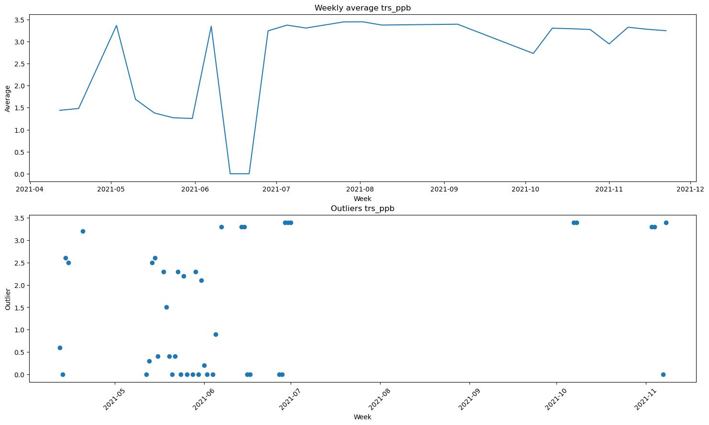
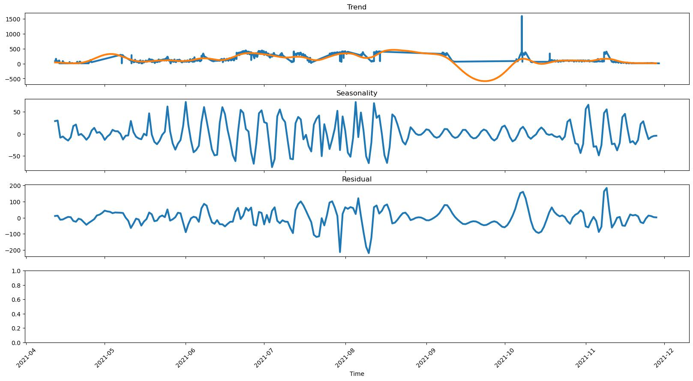
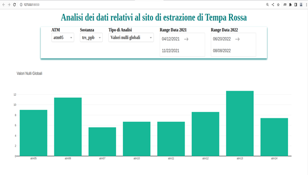
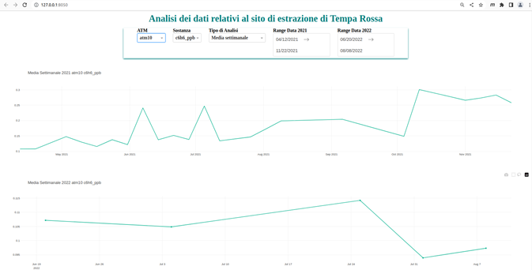
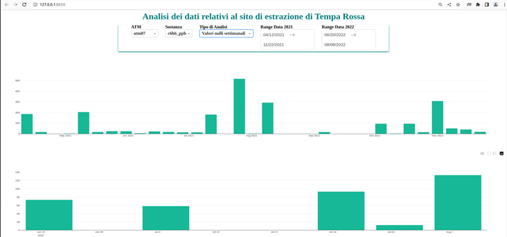
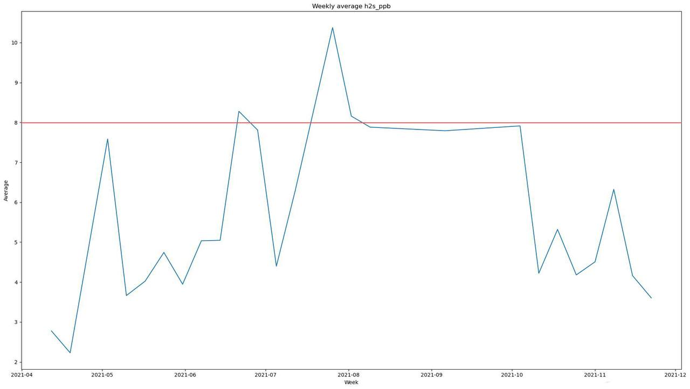
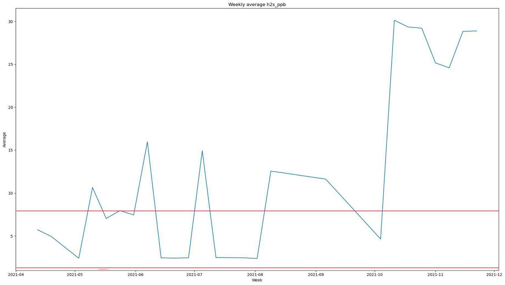
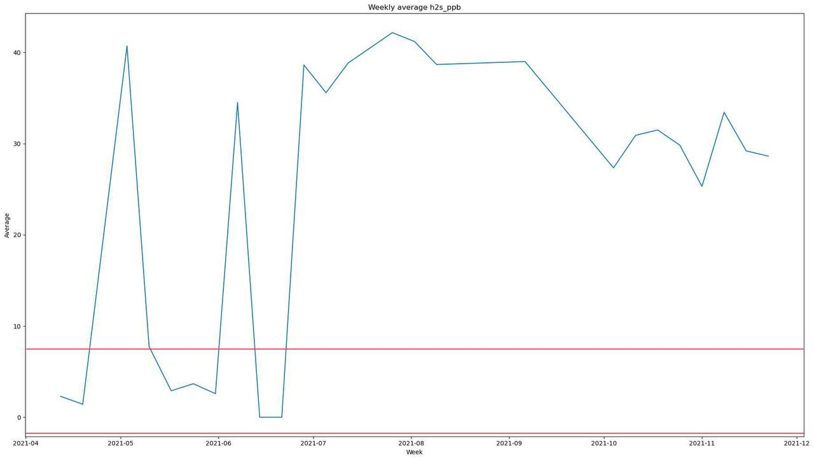

# chemical_emissions_analysis

## Table of contents
- Description
- Technologies
- Tasks performed
- Results

## Description
Data analysis and visualization of data from a local oil extraction site to assess, whether the emissions of chemical compounds produced during extraction, were such that they could be perceived in the surrounding areas and create disturbance to plant personnel and people living or passing through the area.

## Technologies
- Python (Jupyter Notebook)
- SQL
- pandas
- plotly
- matplotlib
- numpy
- psycopg2
- kats
- statsmodel
- Dash (Plotly)

## Task performed
- Data exploration 
- Data cleaning 
- Data analysis (sensor reliability analysis, null values, weekly average, seasonality, outliers, weekly average versus gas flaring events, weekly average versus outliers)

- Interactive dashboard to show the results

## Results

Analyses have shown that one of the possible causes of the odor is H2S emissions, the average values of which practically always exceed the odor threshold (red lines in the images).
No considerations can be made for other chemicals due to unclear and precise information.

